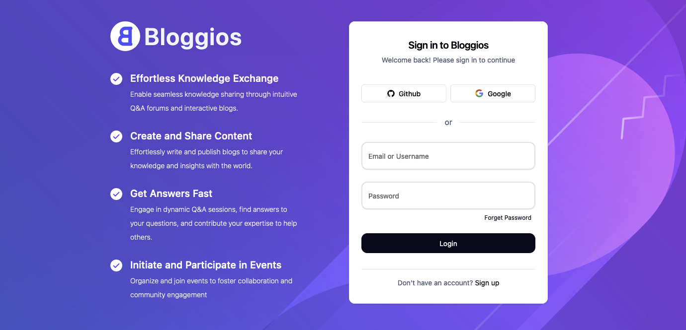

<div align="center">
  <br />
    <a href="https://bloggios.com" target="_blank">
      
    </a>
  <br />

<h2 align="center">Auth Configuration Jar</h2>

  <div>
    
    
    
    
  </div>
</div>

## 📋 <a name="table">Table of Contents</a>

1. 🤖 [Introduction](#introduction)
2. ⚙️ [Tech Stack](#tech-stack)
3. 🔋 [Documentation](#documentation)
4. 🤸 [Quick Start](#quick-start)
5. 🕸️ [Contributing](#contributing)
6. 🔗 [Links](#links)
7. 🙏 [Support](#support)
8. ✨ [Contributors](#contributors)

## <a name="introduction">🤖 Introduction</a>

The **Authentication Configuration Jar** is a crucial component within the **Bloggios Microservices** ecosystem. Built using **Java 17** and leveraging the **Spring Boot Parent**, this open-source project aims to enhance security practices across all microservices individually. By providing comprehensive end-to-end authentication, the jar streamlines security implementation, reduces boilerplate code, and ensures robust protection for each microservice.

## Key Features

1. **Centralized Authentication Logic:**
    - The jar encapsulates authentication-related logic, allowing developers to focus on business-specific functionality rather than repetitive security code.
    - By centralizing authentication, we ensure consistent practices across all microservices.

2. **End-to-End Security:**
    - The jar covers the entire authentication flow, from user login to token validation.
    - It seamlessly integrates with various authentication providers (e.g., OAuth, JWT, SAML) and supports custom authentication mechanisms.

3. **Microservice-Specific Security:**
    - Unlike traditional approaches that rely on an API Gateway for security, Bloggios adopts a microservice-centric model.
    - Each microservice independently handles security, tailoring it to its specific requirements.
    - This approach enhances flexibility, scalability, and resilience.

4. **Reduced Boilerplate Code:**
    - Developers no longer need to duplicate authentication-related code across microservices.
    - The jar abstracts away common tasks, such as token validation, session management, and user authentication.

## Benefits

- **Improved Security Practices:**
    - By applying security measures at the microservice level, we strengthen the overall security posture of Bloggios.
    - Developers can implement best practices without redundancy.

- **Simplified Maintenance:**
    - Updates or changes to authentication logic are made in one place—the jar—rather than across multiple microservices.
    - This simplifies maintenance and reduces the risk of inconsistencies.

- **Community-Driven Development:**
    - As an open-source project, the Authentication Configuration Jar encourages collaboration.
    - Developers worldwide can contribute, review, and enhance security features.

Join our newly active Discord community for support, bug reporting, and feature requests. Here, we strive to address
every issue, and developers and testers can collaborate and assist each other effectively.

<a href="https://discord.gg/sEerF8HuKC" target="_blank">

</a>

## <a name="tech-stack">⚙️ Tech Stack</a>

- Java 17
- Spring Boot
- OAuth2.0
- JWT

## <a name="documentation">🔋 API Documentation</a>

To help you get started with our API and understand all its features and endpoints, we have created detailed
documentation available on Postman. This documentation includes comprehensive information about each endpoint,
including:

- **Endpoint URLs**: Specific paths to access various functionalities.
- **HTTP Methods**: The method type (GET, POST, PUT, DELETE, etc.) for each endpoint.
- **Parameters**: Required and optional parameters, including headers, query parameters, and body content.
- **Request Examples**: Sample requests to demonstrate proper usage.
- **Response Formats**: Expected response structure, including status codes and data formats.
- **Error Handling**: Common error responses and troubleshooting tips.

To access the documentation:

1. **Visit our Postman Documentation Page
   **: [Visit Documentation](https://www.postman.com/rohit-zip/workspace/bloggios/collection/34920421-dbc22257-2de7-4888-a0b1-69d0234bb3b4?action=share&source=copy-link&creator=34920421)
2. **Explore the Collection**: Navigate through the collection to find detailed descriptions and examples for each
   endpoint.
3. **Run Requests Directly in Postman**: Use the "Run in Postman" button to directly import the collection into your
   Postman workspace for testing and exploration.

By leveraging the Postman documentation, you can quickly integrate our API into your application and take full advantage
of its capabilities.

For any further assistance, feel free to contact our support team or refer to the additional resources section in the
documentation.

## <a name="quick-start">🤸 Quick Start</a>

Follow these steps to set up the project locally on your machine.

**Prerequisites**

Make sure you have the following installed on your machine:

- Git
- Java 17
- Intellij Idea or any other IDE supports Spring Boot

**Cloning the Repository**

```bash
git clone <repository-url>
```

**Opening the Project**

Open the project in any of your favourite IDE
We recommended Intellij Idea

Make sure you have Java 17 Installed in your system
Please execute the below command to check installed version of Java in your system

```bash
java --version
```

Replace the placeholder values with your actual credentials

**Running or Compiling the Project**

This is the configuration file repository only so there is no need to run this Repository

One can create a Jar of this application and use it in the other Microservices of Bloggios
to Create a Jar please run the below command on root directory

```bash
mvn clean install
```

If Maven is not installed in your system then run
```bash
./mvnw clean install
```

## <a name="contributing">🧑‍💻Contributing</a>

Any kind of positive contribution is welcome! Please help us to grow by contributing to the project.

If you wish to contribute, you can,

- Star Repositories Bloggios
- Suggest a Feature
- Test the application, and help it improve.
- Improve the app, fix bugs, etc.
- Improve documentation.
- Create content about Bloggios and share it with the world.

> Please read [`CONTRIBUTING`](CONTRIBUTING.md) for details on our [`CODE OF CONDUCT`](CODE_OF_CONDUCT.md), and the
> process for submitting pull requests to us.

🆕 New to Open Source? 💡 Follow this [guide](https://opensource.guide/how-to-contribute/) to jumpstart your Open Source
journey 🚀.

## <a name="links">🔗 Links</a>

- **Devsanbox API's URL** - https://api.bloggios.in (Bloggios Devsandbox API)
- **Devsandbox Environment** - https://dev.bloggios.in (Bloggios Devsandbox) (*Not Deployed yet*)
- **Production Environment** - Not Deployed yet

**Repositories**

- **Auth Provider Application** - [Visit Github](https://github.com/Bloggios/auth-provider-application)
- **User Provider Application** - [Visit Github](https://github.com/Bloggios/user-provider-application)
- **Bloggios Mail Service** - [Visit Github](https://github.com/Bloggios/bloggios-mail-service)
- **Authentication Configuration Jar** - [Visit Github](https://github.com/Bloggios/authentication-configuration-jar)
- **Bloggios Web UI** - [Visit Github](https://github.com/Bloggios/bloggios-web-ui)

## <a name="support">🙏Support</a>

We all need support and motivation. `Bloggios` is not an exception. Please give this project repositories a ⭐️ to
encourage and show that you liked it. Don't forget to leave a star ⭐️ before you move away.

If you found the app helpful, consider supporting us with a coffee.

## <a name="contributors">✨Contributors</a>

Thanks goes to these wonderful people ([emoji key](https://allcontributors.org/docs/en/emoji-key)):

<!-- ALL-CONTRIBUTORS-LIST:START - Do not remove or modify this section -->
<!-- prettier-ignore-start -->
<!-- markdownlint-disable -->
<table>
  <tbody>
    <tr>
      <td align="center" valign="top" width="14.28%"><a href="https://github.com/rohit-zip"><br /><sub><b>Rohit Parihar</b></sub></a><br /><a href="https://github.com/rohit-zip" title="Code">💻</a></td>
    </tr>
  </tbody>
</table>